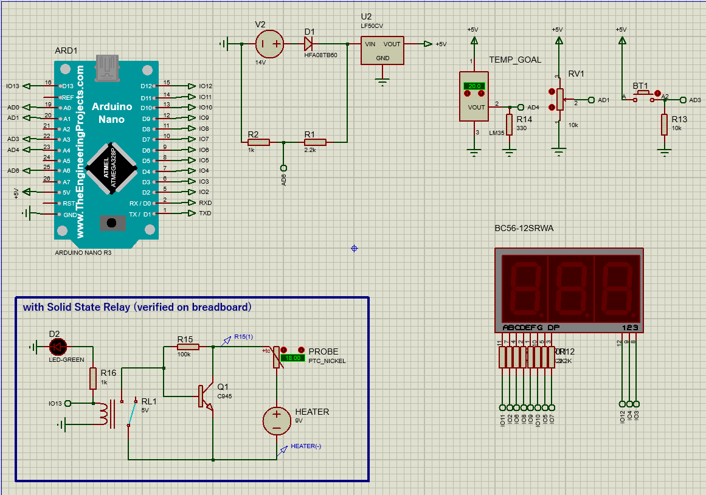
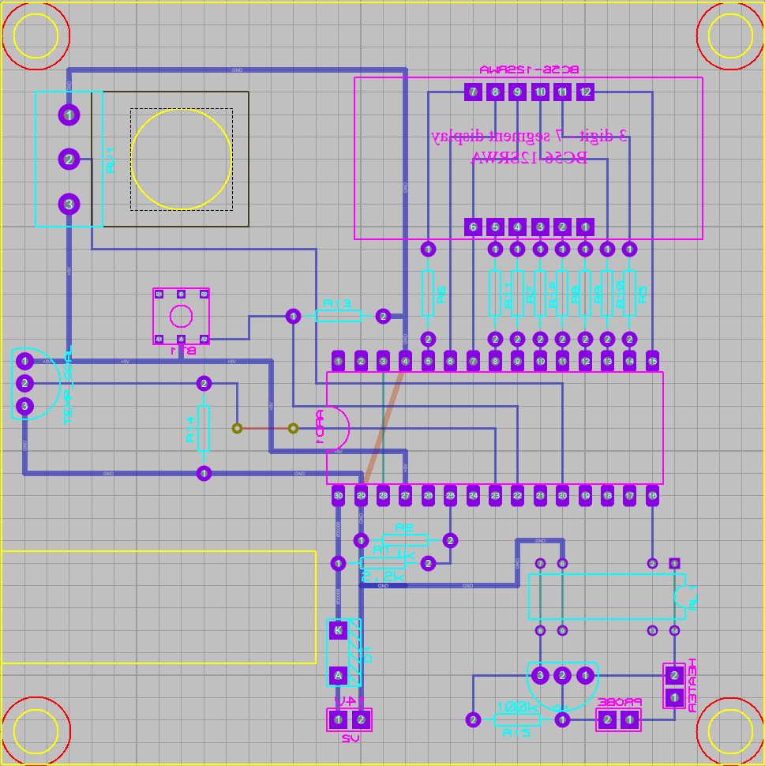
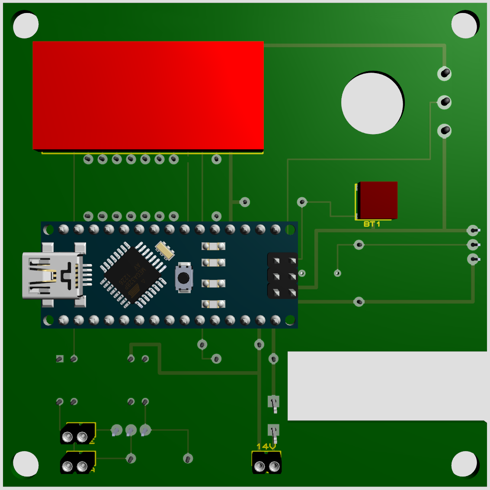
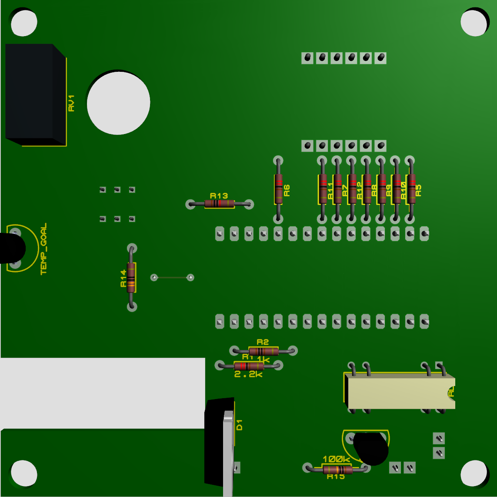
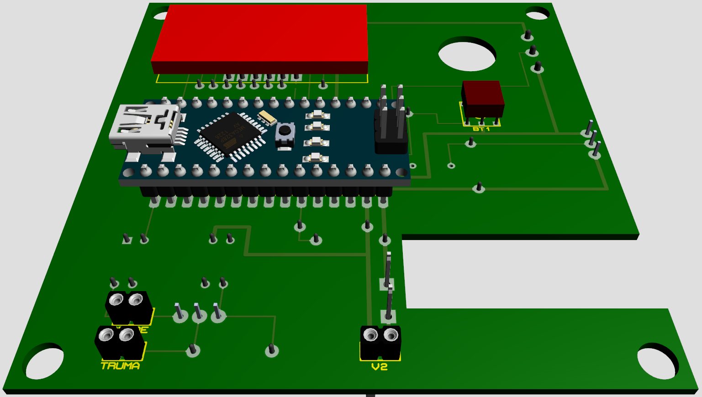
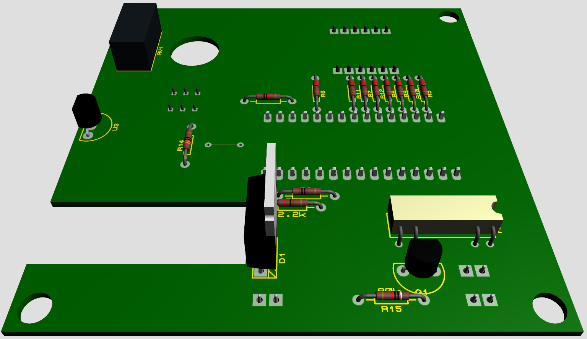
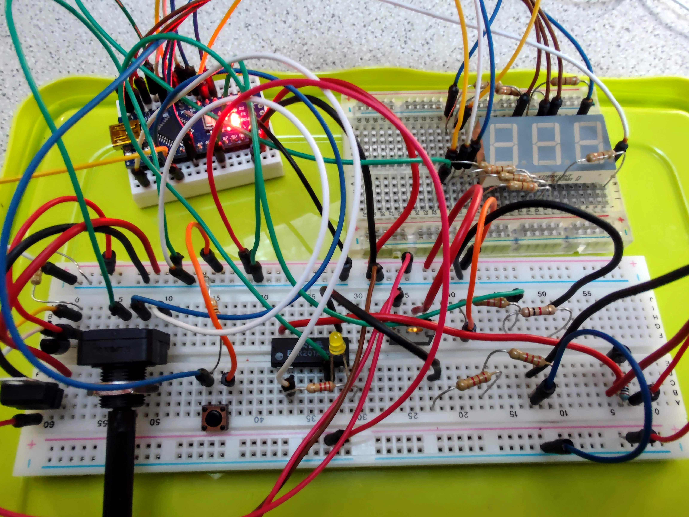

# Digital Thermostat with Arduino Nano

## Goal

Build a 12V digital thermostat to replace/enhance the analog, inexact and voluble one installed in the motorhome

## User manual
- Motorhome
  - switch on the thermostat
  - set the thermostat to the lowest temperature possible or the one you want as minimum
- Digital thermostat
  - Use the potentiometer to select the desired temperature
  - Push the button once to know the ambient temperature
  - Push the button twice to know the desired temperature
  - Push the button for more than 5 seconds to switch off the digital thermostat
- When movement or connection to 220V is detected
  - The digital thermostat will auto-switch off

## Requirements that the project had to fullfill and solutions used

- The existing one must work even if this new one is powered off or broken
  - using e.g. a NPN transistor
- Switching on/off must be silent
  - using e.g. a solid state relay
- Detect when the motorhome is powered on/connected to power surge
  - using an in-built voltimeter
- Detect when the motorhome is moving => switch off the heater
  - using a accelerometer (TODO)
- 12V powered (up to 14V). No batteries
  - direct connection to the motorhome battery
- Fun and easy to build
- Open to changes/improvements
- Easy to maintain

# Included in this repository

- Schematic
- PCB layout
- 3D visualization
- Source Code
- PlatformIO project
- Proteus project
  - Arduino library
  - User library
- Bill of materials

# Skills/tools required

- Basic electronic knowledge
- Basic software development knowledge
- Tools: computer, perfboard, arduino Nano R3, voltimeter, solder, etc
- Patience: because the project in Proteus is very likely that will require some fixing (missing libraries, changes, etc)

# Schematic development

- Get Proteus Professional 8.13 or up
- Open the project, add the libraries
- Add the code with its cpp libraries to the Source Code tab
  - Execute, verify that it works

# Software development

- Get VisualStudio Code, install PlatformIO
- Set the correct platform and baud rate (115200)
- Customize the Shared.h parameters
  - Set the correct REF<->GND voltage
  - Change the DEBUG variable to true, to see the log

# Bill of materials

- Arduino Nano R3
- 3-digit 7-segment display (could be replaced with a LCD)
- LM35 thermostat
- NPN transistor (2N2222 or equivalent)
- perfboard
- etc (check the Bill of Materials below)

[Bill of materials (pdf)](Bill_Of_Materials.pdf)

# Installation

- Place the Thermostat between the heater and its temperature probe.
  - Connect the heater wires to the HEATER connector, pin 1 is '+', pin 2 is 'GND'
  - Connect the temperature probe to the PROBE connector, pin 1 is '+', pin 2 is 'GND'
- Connect to a 12V power surge.

# Notes
- Originally created to enhance the Truma Trumatic C thermostat.
- If you do not have this boiler, you may need to replace the 100KOhm resistor with one appropiated to your heating system. To choose the correct one, try with different ones (or better, infere with voltimeter/amperimeter) until the heater switches on and off when required. Note that the Trumatic C boiler increases the voltage supplied as the thermostat wheel is turn up; and the resistance of the probe decreases as the temperature rises.

# Possible changes/improvements

- Microcontroller
  - Use only the ATmega328P microcontroller instead of the Arduino
  - Use an Arduino Pro Mini/Micro
  - Use a ESP32. Also remove display and button
  - Use an Arduino Nano IoT and connect via bluetooth. Also, remove display and button
- Switch
  - Use a depletion N-Type MOSFET instead of a relay and a transistor
  - Use an optocoupler instead of a solid state relay
  - Use a regular relay instead of a relay and a trasistor, use the NC/NO
- Display
  - Use a 7447 to reduce from 7 to 4 the digital outputs required for the display
  - Use a LCD display instead of the 3-digit 7-segment one
- Use a thermistor instead of the LM35
- Add a buzzer

# Troubleshooting

## Monitor showing strange characters
- Check that baud rates in the app and in platformIO.ini are equal
- Be sure that the processor speed can handle it: http://wormfood.net/avrbaudcalc.php

# Images

## Schematic

## PCB Layout

## 3D

## One of the prototypes in the breadboard

