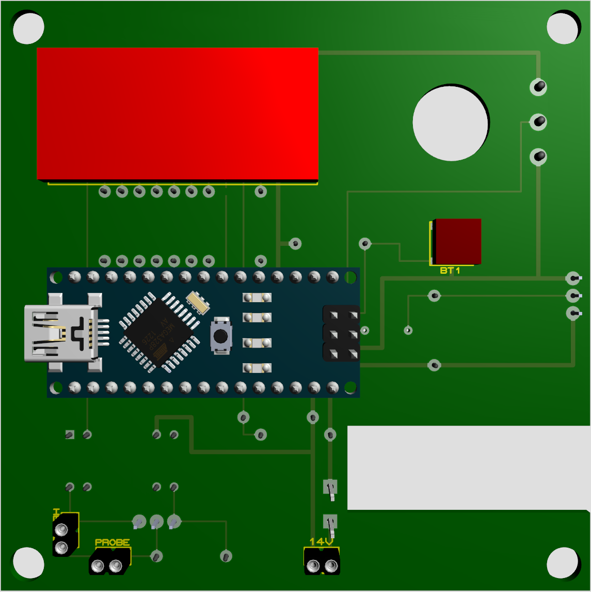
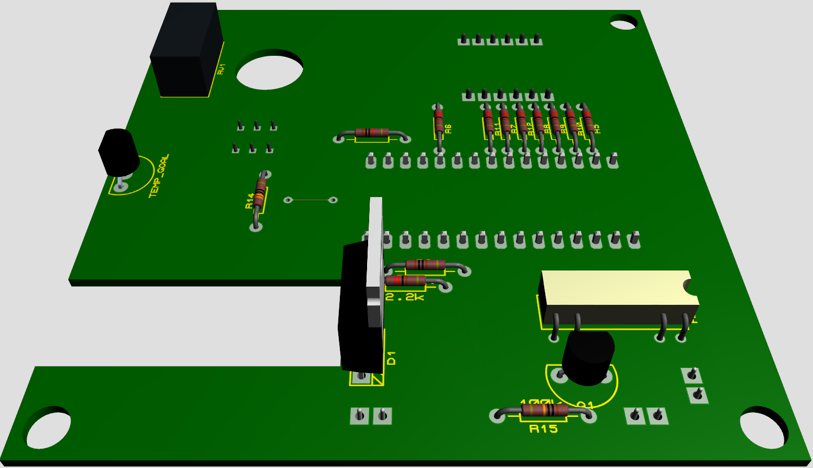

# TODO
get lib files/pictures

# Digital Thermostat with Arduino Nano

## Goal

Build a 12V digital thermostat to replace/enhance the analog and inexact one installed in the motorhome.

## Requisites

- The existing one must work even if this new one is powered off or broken.
- No 'click' sound when switching on/off
- 12V input up to 14/15V
- Fun to build
- Open to changes/improvements
- Easy to maintain

# How to operate

1. Connect power, probe and termostat
2. Select the cooler position in the original heater system
3. Use the potentiometer to select the desired temperature
4. Press the buttom to see the ambient temperature

# Included:

- Schematic
- PCB layout
- 3D visualization
- Source Code
- PlatformIO project
- Proteus project
  - Arduino library
  - User library

# Highlights

- If this themostat is off power, the heating system falls back to the original thermostat
- Notice that both thermostats are active at the same time. The thermostat set to the hi
  - The original heater is still operational. Thus the cooler temperature must be set. Otherwise, the thermostat with the hotter setting will prevail.
- Solid state rele (not 'click' sound)
- Auto-disconnects when an spike in the 12V power surge is detected, thanks to the voltimeter included. In a vehicle, it usually means that it has been started or connected to an external power supply.

# Installation

- Place the Thermostat between the heater and its temperature probe.
  - Connect the heater wires to the HEATER connector, pin 1 is '+', pin 2 is 'GND'
  - Connect the temperature probe to the PROBE connector, pin 1 is '+', pin 2 is 'GND'
- Connect to a 12V power surge.

# Schematic development

- Get Proteus Professional 8.13 or up
- Open the project, add the libraries
- Add the code with its cpp libraries to the Source Code tab
  - Execute, verify that it works

# Software development

- Get VisualStudio Code, install PlatformIO
- Set the correct platform and baud rate (115200)
- Change the DEBUG variable to true, to see the log

# Notes
- Originally created to replace the Truma Trumatic C thermostat.
- You may need to replace the 90KOhm resistor with one appropiated to your heating system. To choose the correct one,

# Required

- Basic electronic knowledge
- Basic software development knowledge
- Tools: computer, perfboard, arduino Nano R3, voltimeter, solder, etc

# Possible changes/improvements

- Use an optocoupler instead of a relay
- Add a buzzer
- Use a thermistor instead of the LM35
- Use only the ATmega328P microcontroller instead of the Arduino
- Use an Arduino Pro Mini
- Use an Arduino Nano IoT and connect via bluetooth. Also, remove display and button

# Troubleshooting

## Project in WSL but VS in Windows
Python 3.8 cannot use UNC paths:
https://github.com/platformio/platformio-core/issues/3417

## Monitor showing strange characters
- Check that baud rates in the app and in platformIO.ini are equal
- Be sure that the processor speed can handle it: http://wormfood.net/avrbaudcalc.php

# Images

## Schematic

## PCB Layout

## 3D

